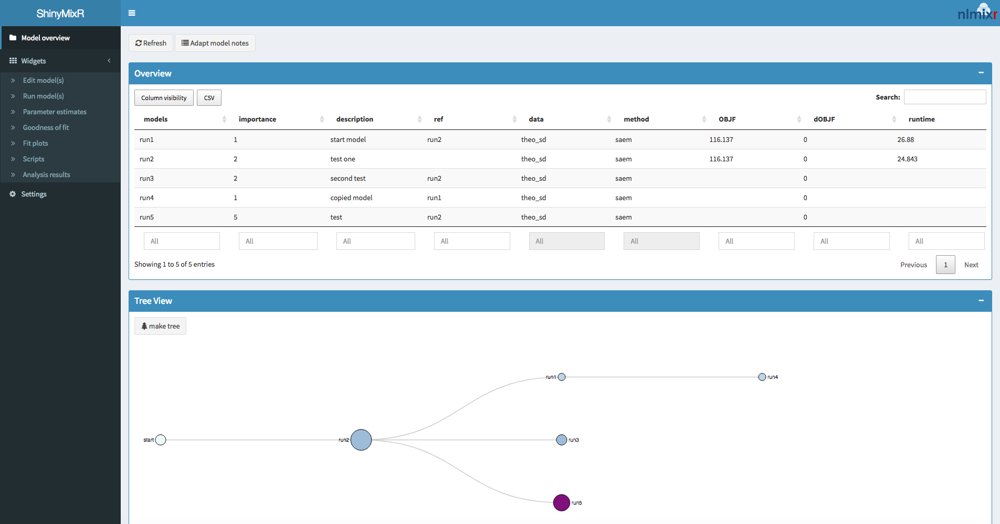
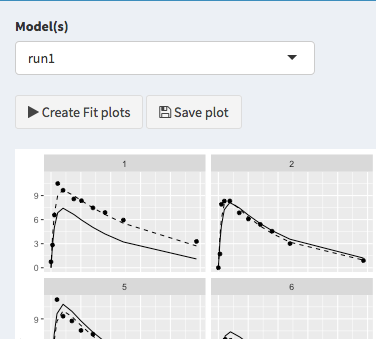
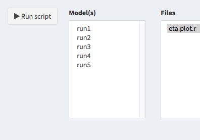

# `nlmixr` vignettes  {#vignettes}

Some _significant_ applications are demonstrated in this chapter; the vignettes will be discussing the application in more depth.


<!-- nlmixr vignette -->

## `nlmixr` domain specific language

```{r eval=FALSE}
library(nlmixr)
?nlmixr
```


Under the hood `nlmixr` has five main modules:  

1. `dynmodel()` and its mcmc cousin `dynmodel.mcmc()` for nonlinear dynamic models of individual data; 
2. `nlme_lin_cmpt()`for one to three linear compartment models of population data with first order absorption, or i.v. bolus, or i.v. infusion using the nlme algorithm; 
3. `nlme_ode()` for general dynamic models defined by ordinary differential equations (ODEs) of population data using the nlme algorithm; 
4. `saem_fit` for general dynamic models defined by ordinary differential equations (ODEs) of population data by the Stochastic Approximation Expectation-Maximization (SAEM) algorithm;  
5. `gnlmm` and `gnlmm2` for generalized non-linear mixed-models (possibly defined by ordinary differential equations) of population data by the adaptive Gaussian quadrature algorithm.


### Rationale

 `nlmixr` estimation routines have their own way of specifying
 models.  Often the models are specified in ways that are most
 intuitive for one estimation routine, but do not make sense for
 another estimation routine.  Sometimes, legacy estimation
 routines like [nlme] have their own syntax that
 is outside of the control of the `nlmixr` package.

 The unique syntax of each routine makes the routines themselves
 easier to maintain and expand, and allows interfacing with
 existing packages that are outside of `nlmixr` (like
 [nlme]).  However, a model definition language
 that is common between estimation methods, and an output object
 that is uniform, will make it easier to switch between estimation
 routines and will facilitate interfacing output with external
 packages like `xpose` and other user-written packages.

 The `nlmixr` mini-modeling language (Domain Specific Language) attempts to address this issue
 by incorporating a common language.  This language is inspired by
 both `R` and `NONMEM`, since these languages are familiar to many
 pharmacometricians.

 **Initial Estimates and boundaries for population parameters**

 `nlmixr` models are contained in a R function with two blocks:
 `ini` and `model`.  This R function can be named
 anything, but is not meant to be called directly from R.  In fact,
 if you try you will likely get an error such as `Error: could
 not find function "ini"`.

**The `ini` model block**

 The `ini` model block is meant to hold the initial estimates
 for the model, and the boundaries of the parameters for estimation
 routines that support boundaries (note `nlmixr`'s `saem`
 and [nlme] do not currently support parameter boundaries).

 To explain how these initial estimates are specified we will start
 with an annotated example:

```{r eval=FALSE}
 f <- function(){ ## Note the arguments to the function are currently
                  ## ignored by `nlmixr`
     ini({
         ## Initial conditions for population parameters (sometimes
         ## called theta parameters) are defined by either `<-` or '='
         lCl <- 1.6      #log Cl (L/hr)
         ## Note that simple expressions that evaluate to a number are
         ## OK for defining initial conditions (like in R)
         lVc = log(90)  #log V (L)
         ## Also a comment on a parameter is captured as a parameter label
         lKa <- 1 #log Ka (1/hr)
         ## Bounds may be specified by c(lower, est, upper), like NONMEM:
         ## Residuals errors are assumed to be population parameters
         prop.err <- c(0, 0.2, 1)
     })
     ## The model block will be discussed later
     model({})
  }


```

 As shown in the above examples:

- Simple parameter values are specified as a R-compatible assignment
- Boundaries may be specified by `c(lower, est, upper)`.
- Like NONMEM, `c(lower,est)` is equivalent to `c(lower,est,Inf)`
- Also like NONMEM, `c(est)` does not specify a lower bound, and is equivalent
   to specifying the parameter  without R's `c` function.
- The initial estimates of the between subject variabilities are specified on the variance scale, and in analogy with
      NONMEM, the square roots of the diagonal elements correspond to coefficients of variation when used in the exponential IIV implementation. This is true, since this is an approximation.  When displaying the %CV in the nlmixr table it uses the: sqrt(exp(v) - 1) * 100 where v=variance of Omega formula. 

 These parameters can be named almost any R compatible name.  Please note that:

 - Residual error estimates should be coded as population estimates (i.e. using an
    '=' or '<-' statement, not a '~'). These are specified on a standard deviation scale.
 - Naming variables that start with "`_`" are not supported.  Note that R does not
     allow variable starting with "`_`" to be assigned without quoting them.
 - Naming variables that start with "`rx_`" or "`nlmixr_`" is not supported since
   `RxODE` and `nlmixr` use these prefixes internally for certain estimation
    routines and calculating residuals.
 - Variable names are case sensitive, just like they are in R. "`CL`" is not the
    same as "`Cl`".


 **Initial Estimates for between subject error distribution (NONMEM's  $OMEGA)**

 In mixture models, multivariate normal individual deviations from
 the population parameters are estimated (in `NONMEM` these are
 called `ETA` parameters).  Additionally, the
 variance/covariance matrix of these deviations are also estimated
 (in `NONMEM` this is the OMEGA matrix).  The initial estimates for variance are specified by the `~` operator in `nlmixr`, which 
 is typically used in R for "modeled by", and was chosen to
 distinguish these estimates from the population and residual error
 parameters.

 Continuing the prior example, we can annotate the estimates for
 the between subject error distribution:

```{r eval=FALSE}
 f <- function(){
     ini({
         lCl <- 1.6      #log Cl (L/hr)
         lVc = log(90)   #log V (L)
         lKa <- 1        #log Ka (1/hr)
         prop.err <- c(0, 0.2, 1)
         ## Initial estimate for ka IIV variance
         ## Labels work for single parameters
         eta.ka ~ 0.1    #BSV Ka

         ## For correlated parameters, you specify the names of each
         ## correlated parameter separated by a addition operator `+`
         ## and the left handed side specifies the lower triangular
         ## matrix initial of the covariance matrix.
         eta.cl + eta.vc ~ c(0.1,
                             0.005, 0.1)
         ## Note that labels do not currently work for correlated
         ## parameters.  Also do not put comments inside the lower
         ## triangular matrix as this will currently break the model.
     })
     ## The model block will be discussed later
     model({})
 }

```
  As shown in the above examples:

 - Simple variances are specified by the variable name and the
    estimate separated by `~`.
 - Correlated parameters are specified by the sum of the variable
    labels and then the lower triangular matrix of the covariance is
    specified on the left hand side of the equation. This is also
    separated by `~`.
 }

 Currently the model syntax does not allow comments inside the
 lower triangular matrix.

**Model Syntax for ODE based models (NONMEM's $PK, $PRED, $DES and $ERROR)**

**The `ini` model block**
 Once the initialization block has been defined, you can define a
 `model` block in terms of the defined variables in the `ini` block.  You can
 also mix in `RxODE` blocks into the model.

 The current method of defining an `nlmixr` model is to specify the
 parameters, and then possibly the `RxODE` lines:

 Continuing describing the syntax with an annotated example:

```{r eval=FALSE}
 f <- function(){
     ini({
         lCl <- 1.6      #log Cl (L/hr)
         lVc <- log(90)  #log Vc (L)
         lKA <- 0.1      #log Ka (1/hr)
         prop.err <- c(0, 0.2, 1)
         eta.Cl ~ 0.1 ## BSV Cl
         eta.Vc ~ 0.1 ## BSV Vc
         eta.KA ~ 0.1 ## BSV Ka
     })
     model({
         ## First parameters are defined in terms of the initial estimates
         ## parameter names.
         Cl <- exp(lCl + eta.Cl)
         Vc <- exp(lVc + eta.Vc)
         KA <- exp(lKA + eta.KA)
         ## After the differential equations are defined
         kel <- Cl / Vc;
         d/dt(depot)  = -KA*depot;
         d/dt(centr)  =  KA*depot-kel*centr;
         ## And the concentration is then calculated
         cp = centr / Vc;
         ## Last, nlmixr is told that the plasma concentration follows
         ## a proportional error (estimated by the parameter prop.err)
         cp ~ prop(prop.err)
     })
 }

```
 A few points to note:

 - Parameters are defined before the differential equations. Currently,
      defining the differential equations directly in terms of the population
      parameters is not supported.
 - The differential equations, parameters and error terms are in a single
      block, instead of multiple sections.
 - State names, calculated variables cannot start with either "`rx_`" or "`nlmixr_`" since these are reserved terms for internal use in some estimation routines.
 - Errors are specified using the `~`.  Currently you can use either `add(parameter)` for additive error,  prop(parameter) for proportional error or `add(parameter1) + prop(parameter2)` for additive plus proportional error.  You can also specify `norm(parameter)` for the additive error, since it follows a normal distribution.
 - Some routines, like `saem` require  parameters in terms of `Pop.Parameter + Individual.Deviation.Parameter + Covariate*Covariate.Parameter`.
      The order of these parameters do not matter.  This is similar to NONMEM's mu-referencing.
 - The type of parameter (population parameter estimate, or individual parameter deviation) in the model is determined by the initial block;  Covariates used in the model are missing in the `ini` block.  These variables need to be present in the modeling dataset for the model to run.


**Model Syntax for solved PK systems**

 Solved PK systems are currently supported by `nlmixr` with the
 `linCmt()` pseudo-function.  An annotated example of a solved
 system is below:

```{r eval=FALSE}
 f <- function(){
     ini({
         lCl <- 1.6      #log Cl (L/hr)
         lVc <- log(90)  #log Vc (L)
         lKA <- 0.1      #log Ka (1/hr)
         prop.err <- c(0, 0.2, 1)
         eta.Cl ~ 0.1 ## BSV Cl
         eta.Vc ~ 0.1 ## BSV Vc
         eta.KA ~ 0.1 ## BSV Ka
     })
     model({
         Cl <- exp(lCl + eta.Cl)
         Vc <- exp(lVc + eta.Vc)
         KA <- exp(lKA + eta.KA)
         ## Instead of specifying the ODEs, you can use
         ## the linCmt() function to use the solved system.
         ##
         ## This function determines the type of PK solved system
         ## to use by the parameters that are defined.  In this case
         ## it knows that this is a one-compartment model with first-order
         ## absorption.
         linCmt() ~ prop(prop.err)
     })
 }
```

 A few things to keep in mind:


- Currently the solved systems support either oral dosing, IV dosing
      or IV infusion dosing and does not allow mixing the dosing types.
- While RxODE allows mixing of solved systems and ODEs, this has not
      been implemented in `nlmixr` yet.
- The solved systems implemented are the one, two and three compartment
       models with or without first-order absorption.  Each of the models support a
       lag time with a tlag parameter (Currently tlag will cause the CWRES/OBJF calculation to stop).
- In general the linear compartment model figures out the model by the parameter names.
       `nlmixr` currently knows about numbered volumes, Vc/Vp, Clearances in terms of both Cl and
       Q/CLD.  Additionally, `nlmixr` knows about elimination micro-constants (ie k12).  Mixing of
       these parameters for these models is currently not supported.


**Checking model syntax**

 After specifying the model syntax you can check that `nlmixr` is
 interpreting it correctly by using the `nlmixr` function on
 it.

 Using the above function we can get:

```{r eval=FALSE}
 > nlmixr(f)
 ## 1-compartment model with first-order absorption in terms of Cl
 ## Initialization:
 ################################################################################
 Fixed Effects ($theta):
     lCl     lVc     lKA
 1.60000 4.49981 0.10000

 Omega ($omega):
      [,1] [,2] [,3]
 [1,]  0.1  0.0  0.0
 [2,]  0.0  0.1  0.0
 [3,]  0.0  0.0  0.1

 ## Model:
 ################################################################################
 Cl <- exp(lCl + eta.Cl)
 Vc <- exp(lVc + eta.Vc)
 KA <- exp(lKA + eta.KA)
 ## Instead of specifying the ODEs, you can use
 ## the linCmt() function to use the solved system.
 ##
 ## This function determines the type of PK solved system
 ## to use by the parameters that are defined.  In this case
 ## it knows that this is a one-compartment model with first-order
 ## absorption.
 linCmt() ~ prop(prop.err)
 
```

 In general this gives you information about the model (what type
 of solved system/RxODE), initial estimates as well as the code for
 the model block.

**Using the model syntax for estimating a model**

 Once the model function has been created, you can use it to estimate the parameters for a model given a dataset.

 This dataset has to have `RxODE` compatible event IDs.  Both
 Monolix and NONMEM use a different dataset description.  You may
 convert these datasets to RxODE-compatible datasets with the
 `nmDataConvert` function.  Note that steady state
 doses are not supported by RxODE, and therefore not supported by
 the conversion function.

 As an example, you can use a simulated rich 1-compartment dataset.

```{r eval=FALSE}
  d <- Oral_1CPT
  d <- d[,names(d) != "SS"];
  d <- nmDataConvert(d);
```

 Once the data has been converted to the appropriate format, you
 can use the `nlmixr` function to run the appropriate code.

 The method to execute the model is:

```{r eval=FALSE}
 fit <- nlmixr(model.function, rxode.dataset, est="est",control=estControl(options))
```

 Currently `nlme` and `saem` are implemented.  For example, to run the
 above model with `saem`, we could have the following:

```{r eval=FALSE}
 > f <- function(){
     ini({
         lCl <- 1.6      #log Cl (L/hr)
         lVc <- log(90)  #log Vc (L)
         lKA <- 0.1      #log Ka (1/hr)
         prop.err <- c(0, 0.2, 1)
         eta.Cl ~ 0.1 ## BSV Cl
         eta.Vc ~ 0.1 ## BSV Vc
         eta.KA ~ 0.1 ## BSV Ka
     })
     model({
         ## First parameters are defined in terms of the initial estimates
         ## parameter names.
         Cl <- exp(lCl + eta.Cl)
         Vc <- exp(lVc + eta.Vc)
         KA <- exp(lKA + eta.KA)
         ## After the differential equations are defined
         kel <- Cl / Vc;
         d/dt(depot)    = -KA*depot;
         d/dt(centr)  =  KA*depot-kel*centr;
         ## And the concentration is then calculated
         cp = centr / Vc;
         ## Last, nlmixr is told that the plasma concentration follows
         ## a proportional error (estimated by the parameter prop.err)
         cp ~ prop(prop.err)
     })
 }
 > fit.s <- nlmixr(f,d,est="saem",control=saemControl(n.burn=50,n.em=100,print=50));
 Compiling RxODE differential equations...done.
 c:/Rtools/mingw_64/bin/g++  -I"c:/R/R-34~1.1/include" -DNDEBUG     -I"d:/Compiler/gcc-4.9.3/local330/include"  -Ic:/nlmixr/inst/include -Ic:/R/R-34~1.1/library/STANHE~1/include -Ic:/R/R-34~1.1/library/Rcpp/include -Ic:/R/R-34~1.1/library/RCPPAR~1/include -Ic:/R/R-34~1.1/library/RCPPEI~1/include -Ic:/R/R-34~1.1/library/BH/include   -O2 -Wall  -mtune=core2 -c saem3090757b4bd1x64.cpp -o saem3090757b4bd1x64.o
 In file included from c:/R/R-34~1.1/library/RCPPAR~1/include/armadillo:52:0,
                  from c:/R/R-34~1.1/library/RCPPAR~1/include/RcppArmadilloForward.h:46,
                  from c:/R/R-34~1.1/library/RCPPAR~1/include/RcppArmadillo.h:31,
                  from saem3090757b4bd1x64.cpp:1:
 c:/R/R-34~1.1/library/RCPPAR~1/include/armadillo_bits/compiler_setup.hpp:474:96: note: #pragma message: WARNING: use of OpenMP disabled; this compiler doesn't support OpenMP 3.0+
    #pragma message ("WARNING: use of OpenMP disabled; this compiler doesn't support OpenMP 3.0+")
                                                                                                 ^
 c:/Rtools/mingw_64/bin/g++ -shared -s -static-libgcc -o saem3090757b4bd1x64.dll tmp.def saem3090757b4bd1x64.o c:/nlmixr/R/rx_855815def56a50f0e7a80e48811d947c_x64.dll -Lc:/R/R-34~1.1/bin/x64 -lRblas -Lc:/R/R-34~1.1/bin/x64 -lRlapack -lgfortran -lm -lquadmath -Ld:/Compiler/gcc-4.9.3/local330/lib/x64 -Ld:/Compiler/gcc-4.9.3/local330/lib -Lc:/R/R-34~1.1/bin/x64 -lR
 done.
 1:    1.8174   4.6328   0.0553   0.0950   0.0950   0.0950   0.6357
 50:    1.3900   4.2039   0.0001   0.0679   0.0784   0.1082   0.1992
 100:    1.3894   4.2054   0.0107   0.0686   0.0777   0.1111   0.1981
 150:    1.3885   4.2041   0.0089   0.0683   0.0778   0.1117   0.1980
 Using sympy via SnakeCharmR
 ## Calculate ETA-based prediction and error derivatives:
 Calculate Jacobian...................done.
 Calculate sensitivities.......
 done.
 ## Calculate d(f)/d(eta)
 ## ...
 ## done
 ## ...
 ## done
 The model-based sensitivities have been calculated.
 It will be cached for future runs.
 Calculating Table Variables...
 done
 
```
 

 The options for `saem` are controlled by `saemControl`.
 You may wish to make sure the minimization is complete in the case
 of `saem`.  You can do that with `traceplot` which shows the
 iteration history with the divided by burn-in and EM phases.  In
 this case, the burn in seems reasonable; you may wish to increase
 the number of iterations in the EM phase of the estimation.
 Overall it is probably a semi-reasonable solution.

**`nlmixr` output objects**

 In addition to unifying the modeling language sent to each of the
 estimation routines, the outputs currently have a unified structure.

 You can see the fit object by typing the object name:

```{r eval=FALSE}
 > fit.s
 nlmixr SAEM fit (ODE)

      OBJF      AIC      BIC Log-likelihood
  62335.96 62349.96 62397.88      -31167.98

 Time (sec; $time):
           saem setup FOCEi Evaulate covariance table
 elapsed 379.32   2.9           1.71          0 19.11

 Parameters ($par.fixed):
              Parameter Estimate     SE     CV Untransformed       (95%CI)
 lCl      log Cl (L/hr)     1.39 0.0240   1.7%          4.01  (3.82, 4.20)
 lVc         log Vc (L)     4.20 0.0256   0.6%          67.0  (63.7, 70.4)
 lKA      log Ka (1/hr)  0.00890 0.0307 344.9%          1.01 (0.950, 1.07)
 prop.err                  0.198                       19.8%

 Omega ($omgea):
            eta.Cl     eta.Vc   eta.KA
 eta.Cl 0.06833621 0.00000000 0.000000
 eta.Vc 0.00000000 0.07783316 0.000000
 eta.KA 0.00000000 0.00000000 0.111673

 Fit Data (object is a modified data.frame):
        ID   TIME    DV      IPRED      PRED         IRES        RES       IWRES
    1:   1   0.25 204.8 194.859810 198.21076   9.94018953   6.589244  0.25766777
    2:   1   0.50 310.6 338.006073 349.28827 -27.40607290 -38.688274 -0.40955290
    3:   1   0.75 389.2 442.467750 463.78410 -53.26775045 -74.584098 -0.60809361
   ---
 6945: 120 264.00  11.3  13.840800  70.58248  -2.54080024 -59.282475 -0.92725039
 6946: 120 276.00   3.9   4.444197  34.41018  -0.54419655 -30.510177 -0.61851500
 6947: 120 288.00   1.4   1.427006  16.77557  -0.02700637 -15.375569 -0.09559342
              WRES       CWRES     CPRED      CRES     eta.Cl     eta.Vc
    1:  0.07395107  0.07349997 198.41341   6.38659 0.09153143  0.1366395
    2: -0.26081216 -0.27717947 349.82730 -39.22730 0.09153143  0.1366395
    3: -0.39860485 -0.42988445 464.55651 -75.35651 0.09153143  0.1366395
   ---
 6945: -0.77916115 -1.34050999  41.10189 -29.80189 0.32007359 -0.1381479
 6946: -0.65906613 -1.28359979  15.51100 -11.61100 0.32007359 -0.1381479
 6947: -0.56746681 -1.22839732   5.72332  -4.32332 0.32007359 -0.1381479
           eta.KA
    1:  0.1369685
    2:  0.1369685
    3:  0.1369685
   ---
 6945: -0.2381078
 6946: -0.2381078
 6947: -0.2381078
```


This example shows the standard printout of an `nlmixr` fit object.  The elements of the fit are:


 - The type of fit (`nlme`, `saem`, etc)
 - Metrics of goodness of fit (`AIC`, `BIC`,
    and `logLik`).

     - To align the comparison between methods, the FOCEi likelihood objective is calculated
           regardless of the method used and used for goodness of fit metrics.
     - This FOCEi likelihood has been compared to NONMEM's objective function and gives
          the same values (based on the data in **Wang 2007** (**INLCUDE REF**))
      - Note that `saem` does not calculate an objective function,
             and the FOCEi is used as the only objective function for the fit.
      - Even though the objective functions are calculated in the same manner, caution should
          be used when comparing fits from various estimation routines.

The next item is the timing of each of the steps of the fit.

- These can be accessed by (`fit.s$time`).
- As a mnemonic, the access for this item is shown in the printout.  This is true for
     almost all of the other items in the printout.

After the timing of the fit, the parameter estimates are displayed (can be accessed by
      `fit.s$par.fixed`
 
- While the items are rounded for R printing, each estimate without rounding is still accessible by the `$` syntax.
   For example, the `$Untransformed` gives the untransformed parameter values.
- The Untransformed parameter takes log-space parameters and back-transforms them to normal parameters.  Not the CIs are listed on the back-transformed parameter space.
- Proportional Errors are converted to %CV on the untransformed space

- Omega block (accessed by `fit.s$omega`)

The table of fit data. Please note:

- An `nlmixr` fit object is actually a data frame.  Saving it as a Rdata object and then loading it without `nlmixr` will just show the data by itself.  Don't worry; the fit information has not vanished, you can bring it back by simply loading `nlmixr`, and then accessing the data.
- Special access to fit information (like the `$omega`) needs `nlmixr` to extract the information.

If you use the `$` to access information, the order of precedence is:
 
- Fit data from the overall data.frame
- Information about the parsed `nlmixr` model (via `$uif`)
- Parameter history if available (via `$par.hist` and `$par.hist.stacked`)
- Fixed effects table (via `$par.fixed`)
- Individual differences from the typical population parameters (via `$eta`)
- Fit information from the list of information generated during the post-hoc residual calculation.
- Fit information from the environment where the post-hoc residual were calculated
- Fit information about how the data and options interacted with the specified model
      (such as estimation options or if the solved system is for an infusion or an IV bolus).


While the printout may display the data as a `data.table` object or `tbl`
     object, the data is NOT any of these objects, but rather a derived data frame.
- Since the object **is*}** a data.frame, you can treat it like one.

 In addition to the above properties of the fit object, there are a
 few additional that may be helpful for the modeler:

- `$theta` gives the fixed effects parameter estimates (in NONMEM the
      `theta`s). This can also be accessed in `nlme` function. Note that the residual variability is treated as a fixed effect parameter
      and is included in this list.
- `$eta` gives the random effects parameter estimates, or in NONMEM the
       `eta`s.  This can also be accessed in using the `random.effects`
 function.
 


<!-- ## `shinyMixR` - project-centric interface {#interface} -->
## `shinyMixR` {#interface}
### Introduction
<!-- # ```{r echo=FALSE, results='hide'} -->
<!-- # knitr::opts_chunk$set(fig.width=7, fig.height=4)  -->
<!-- # ``` -->

The `nlmixr` package can be accessed through command line in `R` and `RStudio`, and through an interface `shinyMixR` supported by the `nlmixr` team. Both command line and interface support the integration with [`xpose.nlmixr`](https://github.com/nlmixrdevelopment/xpose.nlmixr).

`shinyMixR` aims to provide a user-friendly tool for `nlmixr` based on [`Shiny`](https://shiny.rstudio.com/), which facilitates a workflow around an `nlmixr` project. The [`shinydashboard`](https://cran.r-project.org/web/packages/shinydashboard/shinydashboard.pdf) package was used to set up a structure for controlling and tracking runs with an nlmixr project, and was the basis for setting up the modular interface.

This project tool enhances the usability and attractiveness of `nlmixr`, facilitating dynamic and interactive use in real-time for rapid model development. In this project-oriented structure, the command line and dashboard can be used independently and/or interdependently. This means that many of the functions within the package can also be used outside the interface within an interactive R session. 

Using `shinyMixR`, the user specifies and controls an `nlmixr` project workflow entirely in `R`. Within a project folder, a structure can be created to include separate folders for models, data and runs. Functionality is available to edit and execute a model code, summarize and compare model outputs in a tabular fashion, and view and compare model development using a tree paradigm. Inputs, outputs and metadata are stored in relation to the model code within the project structure (a discrete R object) to ensure traceability. 

Results are visualized using modifications of existing packages (such as [`xpose.nlmixr`](https://github.com/nlmixrdevelopment/xpose.nlmixr), user-written functions and packages, or pre-existing plotting functionality included in the `shinyMixR` package. Results are reported using the [R3port](https://github.com/RichardHooijmaijers/R3port) package in pdf and html format.

How the package can be used and what the most important functions are, is described in this section.
When working with this package, there are two important assumptions:

1. A specific folder structure is in place. The package uses this structure to read and write certain files (the folder structure can be generated automatically using the `create_proj` function).
2. Within a folder structure, multiple models can be present and is considered a "project". The package creates and manages a project object which is available in the global environment.

An introduction on how to use the `shinyMixR` interface can be found [here](https://richardhooijmaijers.github.io/shinyMixR/index.html). To get started, first install the package and use the library.

### Getting started

To get started, first install the package using:

```{r eval=FALSE}
devtools::install_github("richardhooijmaijers/shinyMixR")
```

Be aware that the `nlmixr`, `nlmixr.xpose` and `R3port` packages should be installed before installing `shinyMixR`, e.g.:
```{r eval=FALSE}
devtools::install_github("richardhooijmaijers/R3port")
devtools::install_github("nlmixrdevelopment/nlmixr")
devtools::install_github("nlmixrdevelopment/xpose.nlmixr")
```

The easiest way to get to know the package is to create the folder structure (which includes some example models):

```{r eval=FALSE}
library(shinyMixR,quietly = TRUE)
create_proj()
```

By default, a folder structure is created within the current directory. The following folders are created:

- analysis: in this folder all plots and tables are saved in a structured way to make them accesible to the interface
- data: data files used by the models in R data format (.rds) or Excel format (.csv).
- models: models, available as separate R scripts according to the `nlmixr` unified-user-interface R model functions.
- scripts: generic analysis scipts made available in the interface
- shinyMixR: folder used by the interface to store temporarly files and results files

The interface monitors what happens in these folders. This is important to know because new models and/or data can be copied into these folders or files can be removed. This will then be recognized within the app (after refreshing the overview).
This way it is possible to work on data and models separately and plug it in to shinyMixR at a later stage. 

Once there is a folder structure present the interface can be started:

```{r eval=FALSE}
run_shinymixr(launch.browser = TRUE)
```

The interface will be started and a project object will be created in the global environment in which all information is kept/managed. If correct, the interface will open in the default browser and the following will be seen:

```{r shiny1, fig.cap='shinyMixR interface', out.width="60%", fig.align='center', echo=FALSE, message=FALSE}

```

<!--  -->

On the left side, there is a sidebar with various menu items. The content of the main body will open with the model overview but  will change based on the selected menu item in the sidebar. The sidebar can be collapsed by clicking the three lines in the top bar, providing more room for the main body. 

### Overview 

The overview page can be used to see which models are present in a project, the relationship between models and to adapt model meta data. The overview can be exported to a CSV file and a selection of columns can be made that should be displayed (all using the `DT` package).

### Edit models

```{r shiny2, fig.cap='Editing model code', out.width="40%", fig.align='center', echo=FALSE, message=FALSE}
knitr::include_graphics("figures/screen2.png")
```

<!--  -->

The edit tab can be used to edit existing models within an editor including syntax coloring (using `shinyAce`). It is also possible to create new models using various templates or to duplicate existing models.

### Run models
```{r shiny3, fig.cap='Executing model code', out.width='40%', fig.align='center', echo=FALSE, message=FALSE}
knitr::include_graphics("figures/screen3.png")
```

<!--  -->

The run tab can be used to execute models within a project. It is possible to run one or multiple models at once. Also it is possible to assess the intermediate output or progress of an `nlmixr` run.

### Parameter estimates
```{r shiny4, fig.cap='View parameter estimates', out.width='40%', fig.align='center', echo=FALSE, message=FALSE}
knitr::include_graphics("figures/screen4.png")
```

<!--  -->

The parameter estimates tab can be used to generate a table with parameter estimates. In case multiple models are selected the table will show the results of each run in a separate column. This page is reactive which means that in case a different model is selected, the table is directly updated. There is the possiblity to save the table to a latex/pdf or html file.

### Goodness-of-fit

```{r shiny5, fig.cap='Creating goodness-of-fit plots', out.width='40%', fig.align='center', echo=FALSE, message=FALSE}

```
<!--  -->

The goodness-of-fit tab can be used to generate a combination of 4 goodness-of-fit plots combined. By default `nlmixr.xpose` is used but direct ggplot2 can also be used by specifying this in the settings. Plots can be saved to a LaTeX/pdf or html file.

### Fit plots
```{r shiny6, fig.cap='Creating individual fit plots', out.width='40%', fig.align='center', echo=FALSE, message=FALSE}

```
<!--  -->

The fit plots tab can be used to generate individual fit plots. The same options are present here as for the goodness-of-fit plots.

### Scripts
```{r shiny7, fig.cap='Run user defined scripts', out.width='40%', fig.align='center', echo=FALSE, message=FALSE}

```
<!--  -->

It is possible to write your own scripts that can be used to analyse model results. This script can be used to process the result for one or multiple models at once (the interface will include the name of the selected models in the script).
An example of how such a script will look like is included in the package.

### Results
```{r shiny8, fig.cap='View and combine modeling results', out.width='40%', fig.align='center', echo=FALSE, message=FALSE}
knitr::include_graphics("figures/screen8.png")
```
<!--  -->

It is possible to view and combine the results from the models within a project within the last tab.


### Interactive session

When working in an interactive R session, many functions used by the interface are available from an interactive R session. When working outside the interface it is important to know how to interact with the project object.
This object should be created as one of the first steps because other function rely on the availability of this object:

```{r eval=FALSE}
proj_obj <- get_proj()
```

This function will look in the folder structure to create or update the available information. The result is a list that is build-up as follows:

```{r eval=FALSE}
object
|--- run 1
|    |--- model location
|    |--- model meta data
|    |--- model high level results
|
|--- ...
|
|--- meta data (time of last refresh)
```

In case this object is not present it will be created by looking at the files present in the current folder structure. In case the object is already present it will check if newer files are present in the current folder and will update the object with this information. Therefore one has to be aware that this function should be submitted manually in case new information is present in one of the folders.

Once a folder structure is in place and the project object is created, an overview can be created for the available models and when models are executed and running high level results can be viewd. It is also possible to display a collapsible d3 tree view of the models. This is mainly useful in case reference to models is provided to show the hierachy of the models within a project:
```{r eval=FALSE}
overview()
tree_overview()
```

Although the `nlmixr` package has the possibilty to run `nlmixr` models, the `shinyMixR` package has a function available named `run_nmx`. This function allows to run the model in an external R session when executing a run through `shinyMixR`. This is necessary within the interface to overcome the application from freezing when a model is submitted. Also within an interactive R session it is convenient because you do not have to wait for a run to finish. An example on how this can be used is given below:
```{r eval=FALSE}
#proj_obj <- get_proj()
#run_nmx("run1",proj=proj_obj)
```
```{r eval=FALSE}
run_nmx("run1",proj=proj_obj)
# progress of a run is written to external text file
# this can be read-in for intermediate assessment
readLines("shinyMixR/temp/run1.prog.txt")
```

The current version of the package has three functions for assessing the model results: `par_table`, `gof_plot` and `fit_plot`. The first function is to create a simple parameter table `par_table`. By default this function returns a data.frame. In case multiple models are selected, each column will have the results of the selected model. The results can also be written to a PDF (using LaTeX) or html file using the `R3port` package:

```{r eval=FALSE}
par_table(proj_obj,c("run1","run2"))
# par_table(proj_obj, models="run1", outnm="par.tex")
```

For assessing the goodness of fit, the `gof_plot` function can be used. This function will by default use the `nlmixr.xpose` package to create 4 different types of plots. It is also possible to directly create ggplot2 types of plots. By default the plots will be created within the R session but can also be written to pdf/html using the `R3port` package:

```{r eval=FALSE}
res  <- readRDS("./shinyMixR/run1.res.rds")
gof_plot(res)
# gof_plot(res, mdlnm="run1", outnm="gof.tex")
```

The last plot is an individual fit plot `fit_plot`. This function will by default use the `nlmixr.xpose` package to create a plot per individual including the observed data, indivual and population predictions. Also here it is possible to create ggplot2 types of plots and plots can be outputted to pdf/html:

```{r eval=FALSE}
fit_plot(res, type="user")
# fit_plot(res, mdlnm="run1", outnm="fit.html")
```


