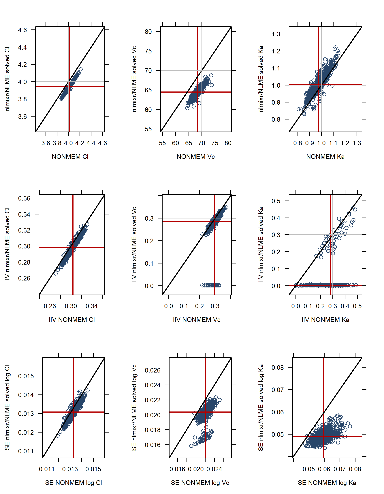

# Applications of `nlmixr` {#applications}


<!-- ## Posters and Presentations -->
## Posters and Presentations

```{r echo=FALSE, results='hide'}
file.copy("posters", "docs/posters", overwrite = TRUE)
```

A series of posters were presented at different conferences where `nlmixr` was compared to `NONMEM`. These findings provide evidence that nlmixr provides a viable open-source parameter estimation alternative for fitting nonlinear mixed effects pharmacometric models within the R environment.

- ACoP 2016, Seattle, USA: <a href="posters/PosterACoP2016.pdf" target="_blank">PosterACoP2016</a>
- WCoP 2016, Brisbane, Australia: <a href="posters/PosterWCoP2016.pdf" target="_blank">PosterWCoP2016</a>
- PAGE 2017, Budapest, Hungary: <a href="posters/PosterPAGE2017.pdf" target="_blank">PosterPAGE2017</a>
- ACoP 2017, Fort Lauderdale, USA: <a href="posters/PosterACoP2017.pdf" target="_blank">PosterACoP2017</a>

On 8 December 2016, Rik Schoemaker presented a seminar on `nlmixr` at Uppsala University with the title: **`nlmixr`: an open-source package for pharmacometric modelling in R** (<a href="posters/PRESnlmixrUppsala161208.pdf" target="_blank">PresentationUppsala161208</a>).

`nlmixr` was presented at the 12^th^ Pharmacometrics Network Benelux Meeting (29 March 2018) with the title: **Simulation (RxODE) and parameter estimation in `nlmixr`** (<a href="posters/PRES nlmixr PNB 180326.pdf" target="_blank">PresentationPNB180326</a>).


<!-- ## Sparse Sampling -->
## Sparse data analysis with `nlmixr`

```{r setup, include=FALSE}
knitr::opts_chunk$set(echo = TRUE, eval=FALSE)
```

### Examination of `nlmixr` estimation algorithm properties for sparse sample data

The NLME and SAEM parameter estimation algorithms were compared with NONMEM FOCEi in a sparse-sampling data setting. To this end, 10,000 patients were simulated after 7 doses with 24 hour intervals with doses split between 10, 30, 60 and 120 mg. Four time points were randomly sampled in the 24 hours after the last dose. A first order absorption, one compartment distribution, and linear elimination model was used with population values of Clearance=4.0 L/hr, Vc=70 L, and KA=1 /hr, 30% IIV for all three parameters (diagonal omega matrix), and 20% residual variability. Of these 10,000 patients, 600 patients were randomly sampled (stratified by dose, 150 subjects per dose), 500 times using PsN and analysed using NONMEM.

The code for the full analysis is provided here along with some output graphs to demonstrate the results. While these are interesting in their own right, the code also demonstrates how to perform parallel analysis of the estimations; with 500 datasets per analysis, it makes perfect sense to be able to run these analyses side-by-side providing you have access to a computer with multiple cores. As these approaches are completely OS-dependent, the code below for running in parallel is only applicable to Windows.

First, we load the packages and define the model using ODEs. Note that [`data.table`](https://cran.r-project.org/package=data.table) is needed to run these examples.

```{r ode_definition}
library(nlmixr)
library(data.table)

#Define the RxODE model
  ode4 <- "
  d/dt(abs)    = -KA*abs;
  d/dt(centr)  =  KA*abs-(CL/V)*centr;
  C2=centr/V;
  "
  
#Create the RxODE simulation object
  mod4 <- RxODE(model = ode4, modName = 'mod4')
```

Generate the 10,000 sampled parameters:

```{r sample_parameters}
#Population parameter values on log-scale
  paramsl <- c(CL = log(4),
               V = log(70),
               KA = log(1))
#make 10,000 subjects to sample from:
  nsubg <- 2500 # subjects per dose
  doses <- c(10, 30, 60, 120)
  nsub <- nsubg * length(doses)
#IIV of 30% for each parameter
  omega <- diag(c(0.09, 0.09, 0.09))# IIV covariance matrix
  sigma <- 0.2
#Sample from the multivariate normal
  set.seed(98176247)
  library(MASS)
  mv <-
    mvrnorm(nsub, rep(0, dim(omega)[1]), omega) # Sample from covariance matrix
#Combine population parameters with IIV
  params.all <-
    data.table(
      "ID" = seq(1:nsub),
      "CL" = exp(paramsl['CL'] + mv[, 1]),
      "V" = exp(paramsl['V'] + mv[, 2]),
      "KA" = exp(paramsl['KA'] + mv[, 3])
    )
#set the doses (looping through the 4 doses)
  params.all[, AMT := 1000 * doses]
```

Then we run the simulation of all these profiles. Here we use `lapply`:

```{r Simulate_profiles}
Startlapply <- Sys.time()
  
#Run the simulations using lapply for speed
  s = lapply(1:nsub, function(i) {
#selects the parameters associated with the subject to be simulated
    params <- params.all[i]
#creates an eventTable with 7 doses every 24 hours
    ev <- eventTable()
    ev$add.dosing(
      dose = params$AMT,
      nbr.doses = 7,
      dosing.to = 1,
      dosing.interval = 24,
      rate = NULL,
      start.time = 0
    )
#generates 4 random samples in a 24 hour period for the last dose
    ev$add.sampling(6 * 24 + c(0, sort(round(sample(runif(600, 0, 1440), 4) / 60, 2))))
#runs the RxODE simulation
    x <- as.data.table(mod4$run(params, ev))
#merges the parameters and ID number to the simulation output
    x[, names(params) := params]
  })
  
#runs the entire sequence of 10000 subjects and binds the results to the object res
  res = as.data.table(do.call("rbind", s))
  
Stoplapply <- Sys.time()
  
Stoplapply - Startlapply
  #10,000 subjects simulated in:
  #Time difference of 29.36007 secs
```

Clean up the results and prepare for analysis uising NONMEM:

```{r clean_simulations}
  setnames(res, "time", "TIME")
#administered dose:
  Dose <- expand.grid(TIME = seq(0, 6 * 24, 24), ID = params.all$ID)
  Dose <- data.table(merge(Dose, params.all, by = "ID"))
  Dose[, C2 := 0]
  Dose[, EVID := 101]
  Dose[, DOSE := AMT / 1000]
  res[, EVID := 0]
  res[, centr := NULL]
  res[, abs := NULL]
  res[, DOSE := AMT / 1000]
  res[, AMT := 0]
#take out the 'trough' (sampling)timepoint used for dosing in this case
  res <- res[TIME != 144]
  res <- rbind(res, Dose)
  setkey(res, ID, TIME)
#Add residual error
  res[, DV := C2 * exp(rnorm(length(C2), 0, sigma))]
  res[, C2 := NULL]
  res[, DV := round(DV)]
#NONMEM EVID is just 1 instead of the RxODE EVID of 101
  res[, EVIDNM := as.numeric(EVID == 101)]
  res <- res[, .(ID, DOSE, V, CL, KA, TIME, EVID, AMT, DV, EVIDNM)]
  write.table(res,file="FullSIM160817.csv",sep=",",col.names=TRUE,quote=FALSE,row.names=FALSE)
```

Then [PsN](https://uupharmacometrics.github.io/PsN/) is used to sample 600 subjects stratified by dose from the 10,000 subjects and analyse these with NONMEM. This is repeated 500 times using PsN bootstrap functionality, creating both 500 sets of output and 500 data files to be analysed using `nlmixr` with the following PsN syntax:

```{}
bootstrap runN024.mod -samples=500 -sample_size=600 -stratify_on=DOSE -no-run_base_model -seed=12345 -threads=15 -directory=runN024
```

and the following NONMEM syntax file:
```{}
    $PROB    ORAL1_1CPT_KAVCL MULTIPLE DOSE FOCEI runN024
    $INPUT   ID DOSE VI CLI KAI TIME EVIDNLMX AMT DV EVID
    $DATA    FullSIM160817.csv IGNORE=@
    $SUBR    ADVAN2,TRANS2
    $PK
    CL=EXP(THETA(1)+ETA(1))
    V=EXP(THETA(2)+ETA(2))
    KA=EXP(THETA(3)+ETA(3))
    S2=V
    $ERROR   
    IPRED = F     
    RESCV = THETA(4) 
    W     = IPRED*RESCV
    IRES  = DV-IPRED
    IWRES = IRES/W
    Y     = IPRED+W*EPS(1)
    $THETA   1.6       ;CL
    $THETA   4.5       ;V
    $THETA   0.2       ;Ka
    $THETA   (0,0.3,1) ;RSV
    $OMEGA   0.15 0.15 0.15
    $SIGMA   1 FIX
    $EST     NSIG=3 PRINT=5 MAX=9999 NOABORT POSTHOC METHOD=COND INTER NOOBT
    $COV
```


The NONMEM results will be provided separately, along with the PsN-generated data files that will be analysed in `nlmixr`. A function `do_nlmixr` is created to read in the data file, define the model, run the parameter estimation, and then save the output file, to be analysed at a later date.

The code to analyse these data sets using SAEM with the solved equations implementation is:

```{r SAEM_solved}
  #SAEM with solved equations:
  
  do_nlmixr <- function(i) {
    datr <-
      read.csv(
        paste("D:\\nmrun\\nmrun1\\m1\\bs_pr1_", i, ".dta", sep = ""),
        header = TRUE,
        stringsAsFactors = F
      )
    
    #If using Microsoft R Open, you need to specify:
    #setMKLthreads(1)
    #Otherwise it accesses too much resources without any gain in speed
    
    one.compartment.oral.model.solved <- function() {
      ini({
        # Where initial conditions/variables are specified
        # '<-' or '=' defines population parameters
        # Simple numeric expressions are supported
        lCl <- 1        #log Cl (L/hr)
        lVc <- 4        #log V (L)
        lKA <- 0.1      #log V (L)
        # Bounds may be specified by c(lower, est, upper), like NONMEM:
        # Residuals errors are assumed to be population parameters
        prop.err <- c(0, 0.2, 1)
        # Between subject variability estimates are specified by '~'
        # Semicolons are optional
        eta.Cl ~ 0.1
        eta.Vc ~ 0.1
        eta.KA ~ 0.1
      })
      model({
        # Where the model is specified
        # The model uses the ini-defined variable names
        Cl <- exp(lCl + eta.Cl)
        Vc <- exp(lVc + eta.Vc)
        KA <- exp(lKA + eta.KA)
        # Solved equations:
        linCmt() ~ prop(prop.err)
      })
    }
    
    fit <-
      nlmixr(
        one.compartment.oral.model.solved,
        datr,
        est = "saem",
        control = saemControl(print = 50)
      )
    
    save(fit, file = paste("fit_SAEM_Solved_UUI_", i, ".Rdata", sep = ""))
  }
```

The code for SAEM with an ODE implementation is:

```{r SAEM_ODE}
  #SAEM with ODE:
  
  do_nlmixrODE <- function(i) {
    datr <-
      read.csv(
        paste("D:\\nmrun\\nmrun1\\m1\\bs_pr1_", i, ".dta", sep = ""),
        header = TRUE,
        stringsAsFactors = F
      )
    
    #If using Microsoft R Open, you need to specify:
    #setMKLthreads(1)
    #Otherwise it accesses too much resources without any gain in speed
    
    one.compartment.oral.model <- function() {
      ini({
        # Where initial conditions/variables are specified
        # '<-' or '=' defines population parameters
        # Simple numeric expressions are supported
        lCl <- 1        #log Cl (L/hr)
        lVc <- 4        #log V (L)
        lKA <- 0.1      #log V (L)
        # Bounds may be specified by c(lower, est, upper), like NONMEM:
        # Residuals errors are assumed to be population parameters
        prop.err <- c(0, 0.2, 1)
        # Between subject variability estimates are specified by '~'
        # Semicolons are optional
        eta.Cl ~ 0.1
        eta.Vc ~ 0.1
        eta.KA ~ 0.1
      })
      model({
        # Where the model is specified
        # The model uses the ini-defined variable names
        Cl <- exp(lCl + eta.Cl)
        Vc <- exp(lVc + eta.Vc)
        KA <- exp(lKA + eta.KA)
        # RxODE-style differential equations are supported
        d / dt(depot)    = -KA * depot
        
        d / dt(centr)  =  KA * depot - (Cl / Vc) * centr
        
        ## Concentration is calculated
        cp = centr / Vc
        
        # And is assumed to follow proportional error estimated by prop.err
        cp ~ prop(prop.err)
        
      })
    }
    
    fit <-
      nlmixr(
        one.compartment.oral.model,
        datr,
        est = "saem",
        control = saemControl(print = 50)
      )
    
    save(fit, file = paste("fit_SAEM_ODE_UUI_", i, ".Rdata", sep = ""))
  }
```

NLME with solved equations:

```{r nlme_solved}
  #nlme with solved equations:
  
  
  do_nlmixr_nlme <- function(i) {
    datr <-
      read.csv(
        paste("D:\\nmrun\\nmrun1\\m1\\bs_pr1_", i, ".dta", sep = ""),
        header = TRUE,
        stringsAsFactors = F
      )
    
    one.compartment.oral.model.solved <- function() {
      ini({
        # Where initial conditions/variables are specified
        # '<-' or '=' defines population parameters
        # Simple numeric expressions are supported
        lCl <- 1        #log Cl (L/hr)
        lVc <- 4        #log V (L)
        lKA <- 0.1      #log V (L)
        # Bounds may be specified by c(lower, est, upper), like NONMEM:
        # Residuals errors are assumed to be population parameters
        prop.err <- c(0, 0.2, 1)
        # Between subject variability estimates are specified by '~'
        # Semicolons are optional
        eta.Cl ~ 0.1
        eta.Vc ~ 0.1
        eta.KA ~ 0.1
      })
      model({
        # Where the model is specified
        # The model uses the ini-defined variable names
        Cl <- exp(lCl + eta.Cl)
        Vc <- exp(lVc + eta.Vc)
        KA <- exp(lKA + eta.KA)
        # Solved equations:
        linCmt() ~ prop(prop.err)
      })
    }
    
    fit <-
      nlmixr(
        one.compartment.oral.model.solved,
        datr,
        est = "nlme",
        control = nlmeControl(pnlsTol = .1)
      )
    
    save(fit, file = paste("fit_NLME_Solved_UUI_", i, ".Rdata", sep = ""))
  }
```

and finally nlme with ODE:

```{r nlme_ODE}
  #nlme with ODE:
  
  
  do_nlmixrODE_nlme <- function(i) {
    datr <-
      read.csv(
        paste("D:\\nmrun\\nmrun1\\m1\\bs_pr1_", i, ".dta", sep = ""),
        header = TRUE,
        stringsAsFactors = F
      )
    
    one.compartment.oral.model <- function() {
      ini({
        # Where initial conditions/variables are specified
        # '<-' or '=' defines population parameters
        # Simple numeric expressions are supported
        lCl <- 1        #log Cl (L/hr)
        lVc <- 4        #log V (L)
        lKA <- 0.1      #log V (L)
        # Bounds may be specified by c(lower, est, upper), like NONMEM:
        # Residuals errors are assumed to be population parameters
        prop.err <- c(0, 0.2, 1)
        # Between subject variability estimates are specified by '~'
        # Semicolons are optional
        eta.Cl ~ 0.1
        eta.Vc ~ 0.1
        eta.KA ~ 0.1
      })
      model({
        # Where the model is specified
        # The model uses the ini-defined variable names
        Cl <- exp(lCl + eta.Cl)
        Vc <- exp(lVc + eta.Vc)
        KA <- exp(lKA + eta.KA)
        # RxODE-style differential equations are supported
        d / dt(depot)    = -KA * depot
        
        d / dt(centr)  =  KA * depot - (Cl / Vc) * centr
        
        ## Concentration is calculated
        cp = centr / Vc
        
        # And is assumed to follow proportional error estimated by prop.err
        cp ~ prop(prop.err)
        
      })
    }
    
    
    fit <-
      nlmixr(
        one.compartment.oral.model,
        datr,
        est = "nlme",
        control = nlmeControl(pnlsTol = .1)
      )
    
    save(fit, file = paste("fit_NLME_ODE_UUI_", i, ".Rdata", sep = ""))
  }
```


To run these analyses in parallel, you need to set up a local virtual cluster using the `doParallel` package, in this case with 15 cores, but adjust to your own hardware:

```{r doParallel}
  #install.packages("doParallel")  
  library(doParallel)
  cl <- makeCluster(15)
  registerDoParallel(cl)
```

And then run the 500 analyses using `foreach` syntax. SAEM with ODEs takes a long time for 600 subjects and 4 samples per subject, and so this example only runs 15 analyses:

```{r SAEMODE_run}
  timeS_Sparse <- Sys.time()
  nlmixr_out <-
    foreach(i = 1:15, .packages = c('nlmixr')) %dopar% do_nlmixrODE(i)
  timeE_Sparse <- Sys.time()
  timeE_Sparse - timeS_Sparse
#Time difference of 1.216711 hours for only 15 runs in parallel on a 15 core cluster
```

But SAEM with solved equations is much faster!

```{r SAEMsolved_run}
  timeS_Sparse <- Sys.time()
  nlmixr_out <-
    foreach(i = 1:500, .packages = c('nlmixr')) %dopar% do_nlmixr(i)
  timeE_Sparse <- Sys.time()
  timeE_Sparse-timeS_Sparse
#Time difference of 3.656132 hours
```

NLME with solved systems is even faster:

```{r nlmesolved_run}
  timeS_Sparse <- Sys.time()
  nlmixr_out <-
    foreach(i = 1:500, .packages = c('nlmixr')) %dopar% do_nlmixr_nlme(i)
  timeE_Sparse <- Sys.time()
  timeE_Sparse - timeS_Sparse
#Time difference of 43.58214 mins
```

and NLME with ODEs is still very doable:

```{r nlmeODE_run}
  timeS_Sparse <- Sys.time()
  nlmixr_out <-
    foreach(i = 1:500, .packages = c('nlmixr')) %dopar% do_nlmixrODE_nlme(i)
  timeE_Sparse <- Sys.time()
  timeE_Sparse - timeS_Sparse
#Time difference of 2.432612 hours
```

You can then read in the output from the 500 `nlmixr` analyses. With the new unified user interface, a single read routine suffices!

```{r Read_nlmixr}
Read_nlmixr <- function(Identifier) {
  for (i in 1:500) {
    filename <- paste(Identifier, "_", i, ".Rdata", sep = "")
    
    if (file.exists(filename)) {
      load(filename)
      TMSE <- fit$par.fixed$SE
      TM <- fit$theta
      names(TMSE) <- paste(names(TM), "_SE", sep = "")
      Time <- c("Time" = fit$table.time["elapsed"])
      IIV <- sqrt(diag(fit$omega))
      run <- c("Run" = i)
      MISSING_CWRES <- c("MISSING_CWRES" = sum(is.na(fit$CWRES)))
      TM <- c(run, TM, TMSE, Time, IIV, MISSING_CWRES)
      TM <- as.data.frame(t(TM))
      fit <- NULL
      print(i)
      if (i == 1) {
        nlmixrpars <<- TM
      } else{
        nlmixrpars <<- rbind(nlmixrpars, TM)
      }
    }
  }
  
  save(nlmixrpars, file = paste(Identifier, ".Rdata", sep = ""))
  
}

Read_nlmixr(Identifier = "fit_NLME_Solved_UUI")
#Read_nlmixr(Identifier = "fit_NLME_ODE_UUI")
#Read_nlmixr(Identifier = "fit_SAEM_Solved_UUI")
```

These results can then be compared with the NONMEM output and plotted to see the results. Let's start with a comparison of nlme results and NONMEM estimates. The results generated for nlme using solved equations are provided in Figure \@ref(fig:fig1).


```{r fig1, fig.cap='Sparse data analysis results: NONMEM FOCE-I solved vs. nlmixr/NLME solved. Cl (left column), Vc (middle column), and Ka (right column), for the population parameter (top row), IIV (middle row), and SE of the log population estimate (bottom row)', out.width='80%', fig.asp=.75, fig.align='center', echo=FALSE, eval=TRUE}

```

<!--  -->

Estimates for population parameters (CL, Vc, Ka) match well between NONMEM and NLME, and IIV for CL looks fine as well. However, when IIVs become a bit more difficult to estimate, like for Vc, and for Ka especially, NLME tends to return IIV values of zero quite frequently.

The next step is to compare the results for NLME with models implemented using solved equations vs. the ODE implementation (Figure \@ref(fig:fig2).


<!--  -->

```{r fig2, fig.cap='Sparse data analysis results: nlmixr/NLME solved vs. nlmixr/NLME ODE. Cl (left column), Vc (middle column), and Ka (right column), for the population parameter (top row), IIV (middle row), and SE of the log population estimate (bottom row)', out.width='80%', fig.asp=.75, fig.align='center', echo=FALSE, eval=TRUE}
knitr::include_graphics("figures/NLMESolvedODEFig1.png")
```


As is clear from the graph, there is some discrepancy between the outcomes of the two model-definition methods, but this is to be expected with any numerical approach.

Next, SAEM results are compared with NONMEM FOCEi. At this stage, estimating ODE models with a large number of subjects is prohibitively time-consuming using SAEM, and so only SAEM with solved solution results are presented (Figure \@ref(fig:fig3)).

<!--  -->

```{r fig3, fig.cap='Sparse data analysis results: NONMEM FOCE I solved vs. nlmixr/SAEM solved. Cl (left column), Vc (middle column), and Ka (right column), for the population parameter (top row), IIV (middle row), and SE of the log population estimate (bottom row)', out.width='80%', fig.asp=.75, fig.align='center', echo=FALSE, eval=TRUE}
knitr::include_graphics("figures/SAEMsolvedFig1.png")
```


These results show a near perfect match between NONMEM and `nlmixr`/SAEM population estimates, and a very good match for IIV estimates as well, where it is noted that for Ka, NONMEM estimates a number of IIVs at zero, while SAEM never does this. The standard errors for NONMEM are larger than for SAEM in all cases, but it is difficult to say which one is correct: for population parameters and IIVs, the values simulated from are known, but for standard errors this is not the case.

Finally, for a comparison between methods in terms of speed of calculations see Figure \@ref(fig:fig4). It is clear that NONMEM is faster in virtually all cases (and SAEM with ODEs is not even reported) and these comparisons are with single-thread NONMEM. However, speeds are not so prohibitively high that use in daily practice is crippled.

<!--  -->

```{r fig4, fig.cap='Comparison of runtimes vs NONMEM FOCE I: nlmixr/NLME solved (left), nlmixr/NLME ODE (middle), SAEM solved (right)', out.width='80%', fig.asp=.75, fig.align='center', echo=FALSE, eval=TRUE}
knitr::include_graphics("figures/RuntimesFig1.png")
```


## Course: PAGE 2018

The `nlmixr` team will present a one-day course  at PAGE 2018, in Montreux, Switzerland. Here we show some of the more interesting examples to be covered in the hands-on session.

### Examplomycin: a simple PK model with covariates

First, we load required libraries...

```{r eval=F}

library(gridExtra)
library(RxODE)
library(MASS)
library(data.table)
library(ggplot2)
library(nlmixr)
library(xpose)
library(xpose.nlmixr)
library(shinyMixR)
library(vpc)

```

We simulate some PK data for our imaginary compound using `RxODE`:

```{r eval=F}

mod <- RxODE({
  k10 = CL/V2
  k12 = Q/V2
  k21 = Q/V3
  d/dt(depot) =-KA*depot;
  d/dt(centr) = KA*depot - k10*centr - k12*centr + k21*peri;
  d/dt(peri)  =                        k12*centr - k21*peri;
  C2 = centr/V2;
  C3 = peri/V3;
  cp = C2 #*(1+cp.err)
})

theta <- c(TKA=1.05, TCL=0.121, TV2=1.939,
           TQ=0.282, TV3=5.65)

omegaCor <- matrix(c(1,    0.5, 0.25, 0.1,  0,
                     0.5,  1,   0.5,  0.1,  0,
                     0.25, 0.5, 1,    0.1,  0,
                     0.1,  0.1, 0.1,  1,    0,
                     0,    0,   0,    0,    1), dimnames=list(NULL,c("eta.CL","eta.V2","eta.V3", "eta.Q", "eta.KA")), nrow=5)

iiv.sd <- c(0.25, 0.25, 0.25, 0.3, 0.3) ## SDs of model parameters

iiv <- iiv.sd %*% t(iiv.sd)
omega <- iiv * omegaCor  # covariance matrix

sigma <- diag(1)*0.1
dimnames(sigma) <- list(NULL, c("cp.err"))

set.seed(740727)

mv <- mvrnorm(40, rep(0, dim(omega)[1]), omega) # Sample from covariance matrix

# Combine population parameters with IIV
params.all <-
  data.table(
    "ID" = seq(1:40),
    "CL" = theta['TCL'] * exp(mv[, 1]),
    "V2" = theta['TV2'] * exp(mv[, 2]),
    "V3" = theta['TV3'] * exp(mv[, 3]),
    "Q"  = theta['TQ']  * exp(mv[, 4]),
    "KA" = theta['TKA'] * exp(mv[, 5]),
    "WT" = round(rnorm(40,70,15)),
    "SEX" = rbinom(n = 40, prob = 0.5, size =1)
  )
# set the doses (looping through the 4 doses)
params.all[, AMT := 1200]

params.all$CL <- params.all$CL * (params.all$WT/70)^0.75
params.all$V2 <- params.all$V2 * (1 - 0.2 * params.all$SEX)

params.all$lWT <- log(params.all$WT/70)

s = lapply(1:40, function(i) {
  # selects the parameters associated with the subject to be simulated
  params <- params.all[i]
  # creates an eventTable with 7 doses every 24 hours
  ev <- eventTable()
  ev$add.dosing(
    dose = params$AMT,
    nbr.doses = 28,
    dosing.to = 1,
    dosing.interval = 24,
    rate = NULL,
    start.time = 0
  )

  smp <- c(round(runif(1, 0, 1),3),
           round(runif(1, 1, 3),3),
           round(runif(1, 3, 6), 3),
           round(runif(1, 6, 12), 3),
           round(runif(1, 18, 23.9), 3),
           round(runif(1, 168, 169),3),
           round(runif(1, 169, 171),3),
           round(runif(1, 171, 180),3),
           round(runif(1, 188, 191.9),3))

  ev$add.sampling(smp)

  x <- as.data.table(mod$run(params, ev))
  x$rv <- rnorm(nrow(x), 0, 0.075)
  x$DV <- round(x$cp * (1 + x$rv),1)
  x$ID <- i

  x[, names(params) := params]
})

sim <- as.data.table(do.call("rbind", s))

setnames(sim, "time", "TIME")

Dose <- expand.grid(TIME = seq(0, 7 * 24, 24), ID = params.all$ID, DV=0)
Dose <- data.table(merge(Dose, params.all, by = "ID"))
Dose[, EVID := 101]

sim[, EVID := 0]
sim[, AMT := 0]

sim <- sim[,c("ID","TIME","DV","WT","SEX","AMT","EVID")]
dat <- rbind(sim, Dose[,c("ID","TIME","DV","WT","SEX","AMT","EVID")])
setkey(dat, ID, TIME)

```


#### Data exploration

Plotting the data reveals that we are probably dealing with a two-compartmental system (Figure \@ref(fig:plotdata)). That said, let's run through all possibilities.

```{r eval=F}

dat$Day <- "Day 1"
dat$Day[dat$TIME>167] <- "Day 8"

ggplot(subset(data.frame(dat), EVID==0), aes(TIME, DV)) + geom_point(col="#1F4E79") +
  geom_line(aes(group=ID), col="#1F4E79") +
  scale_x_continuous("Time (h)") +
  scale_y_log10("Concentration (mg/L)") +
  facet_wrap(~ Day, scales="free_x")

```

```{r plotdata, fig.cap='Simulated examplomycin data, by day', out.width='80%', fig.align='center', echo=FALSE, eval=TRUE}
knitr::include_graphics("figures/examplomycin_plotdata.png")
```

#### Model fitting

Working through model development in the usual way, we eventually arrive at a model which looks like this...

```{r eval=F}

model.2cpt.ode.wtcl.sexv2 <- function() {
  ini({
    tka <- log(1.14)
    tcl <- log(0.0190)
    tv2  <- log(2.12)
    tv3  <- log(20.4)
    tq   <- log(0.383)
    wteff  <- 0.35
    sexeff <- -0.2
    eta.ka ~ 1
    eta.cl ~ 1
    eta.v2 ~ 1
    eta.v3 ~ 1
    eta.q ~ 1
    prop.err <- 0.075
  })
  model({
    ka <- exp(tka + eta.ka)
    cl <- exp(tcl + wteff*lWT + eta.cl)
    v2 <- exp(tv2 + sexeff*SEX + eta.v2)
    v3 <- exp(tv3 + eta.v3)
    q  <- exp(tq + eta.q)
    d/dt(depot) = -ka * depot
    d/dt(center) = ka * depot - cl / v2 * center + q/v3 * periph - q/v2 * center
    d/dt(periph) = q/v2 * center - q/v3 * periph
    cp = center / v2
    cp ~ prop(prop.err)
  })
}

fit.2cpt.ode.wtcl.sexv2.saem <- nlmixr(model.2cpt.ode.wtcl.sexv2, dat, est="saem")

```

Notice how covariates have been included. `lWT` is pre-processed body weight (`log(WT/70)`) and `SEX` is a binary variable equal to 0 (male) or 1 (female).

We can now have a look at some diagnostics...

```{r eval=F}

print(fit.2cpt.ode.wtcl.sexv2.saem)

```

GOF plots (Figure \@ref(fig:2cptwtsex-xpose)) look OK and the VPC suggests the model does a good job of predicting the data (Figure \@ref(fig:2cptwtsex-vpc)).


```{r eval=F}

# create xpose data object
xp.2cpt.wtcl.sexv2.ode.saem <- xpose_data_nlmixr(fit.2cpt.ode.wtcl.sexv2.saem, 
                                                 xp_theme = theme_xp_nlmixr())

xp1 <- dv_vs_pred(xp.2cpt.wtcl.sexv2.ode.saem, title = "DV vs PRED", 
                  subtitle = NULL, caption = NULL) + 
  coord_cartesian(ylim=c(0,1000), xlim=c(0,1000))

xp2 <- dv_vs_ipred(xp.2cpt.wtcl.sexv2.ode.saem, title = "DV vs IPRED", 
                   subtitle = NULL, caption = NULL) + 
  coord_cartesian(ylim=c(0,1000), xlim=c(0,1000))

xp3 <- res_vs_idv(xp.2cpt.wtcl.sexv2.ode.saem, res = "CWRES", title = "CWRES vs time", 
                  subtitle = NULL, caption = NULL) + 
  coord_cartesian(ylim=c(-3.5,3.5))

xp4 <- res_vs_pred(xp.2cpt.wtcl.sexv2.ode.saem, res = "CWRES", title = "CWRES vs PRED", 
                   subtitle = NULL, caption = NULL)+ 
  coord_cartesian(ylim=c(-3.5,3.5))

grid.arrange(xp1, xp2, xp3, xp4, nrow=2)

```

```{r 2cptwtsex-xpose, fig.cap='Basic goodness-of-fit plots for base model with weight on CL and sex on V2', out.width='80%', fig.align='center', echo=FALSE, eval=TRUE}

```


```{r eval=F}

vpc(fit.2cpt.ode.wtcl.sexv2.saem, nsim=400,show=list(obs_dv=T)) + 
  scale_x_continuous("Time (h)") + 
  scale_y_continuous("Examplomycin concentration")

```


```{r 2cptwtsex-vpc, fig.cap='VPC for base model with weight on CL and sex on V2, n=400', out.width='80%', fig.align='center', echo=FALSE, eval=TRUE}

```


